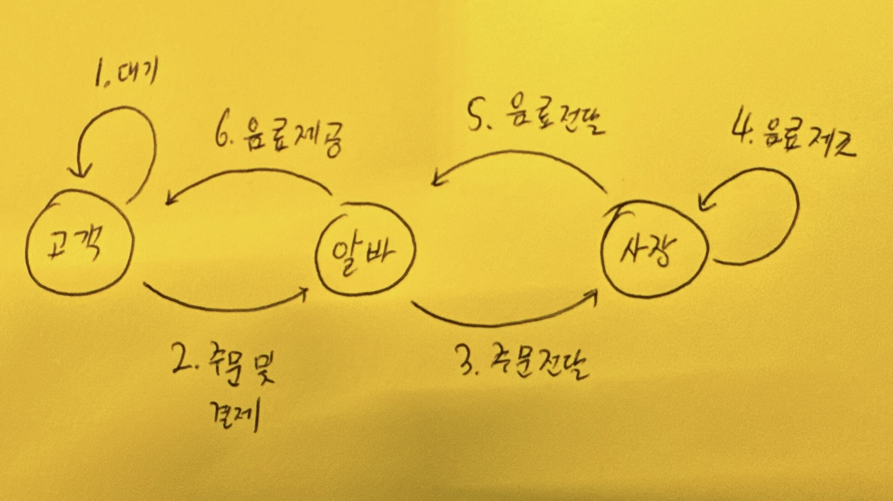

# Chapter 1: 상황 파악

디자인팀이 제품을 만들 때 어떤 상황 속에서 제품을 만들게 된다. 회사의 서비스 안에서 제품을 만들 수 있고 특정 도메인 내에서 창업을 하면서 제품을 만들기도 한다.
그리고 이러한 상황은 디자인팀이 만들어야 하는 제품의 기본적인 틀을 제공한다. 예를 들어서 커머스 회사에서 리뷰 시스템을 만들 수도 있고, SNS 회사에서 숏폼 컨텐츠 인터페이스를 만들 수도 있다. 설령 창업을 한다고 하더라도 기본적인 방향은 갖춰진 상태에서 할 것이다. 창업자는 도시의 교통 문제를 해결 하고 싶다던지 음식 배달 경험을 편리하게 바꾸고 싶다던지 하는 문제를 안고 있을 것이고 그러한 문제가 기본적인 제품의 틀을 결정한다.

이라헌 틀은 컨텍스트라고도 볼 수 있는데, 제품 디자인의 시작은 이 컨텍스트를 이해하는 것이다. 컨텍스트를 이해 한다는 것을 좀 더 쉽게 이야기 한다면, 디자인팀이 만들려고 하는 제품이 속한 도메인에 대한 기본적인 지식들을 쌓는 것이다. 이해를 돕기 위해서 이 소책자에서는 가상의 회사의 가상의 제품을 만드는 과정을 예시로 사용하겠다. `경험커피` 라는 카페에서 키오스크를 설치해서 주문을 좀 더 효율적으로 처리하고 싶다. `경험커피`는 브랜드 커피가 아니고 개인 카페인데, 주변에 사무실이 많이 있어서 평일 점심 시간에 매우 붐빈다. 하지만 그 외의 시간에는 한적하다. 이제 이 `경험커피`의 컨텍스트를 이해해 보자. 당신은 `경험커피`의 유일한 프로덕트 디자이너이고 임무는 `경험커피`의 키오스크 제품을 디자인 하는 것이다.

## 컨텍스트 이해하기

컨텍스트를 이해 하는 것에는 정해진 방법이 있지는 않고 도메인과 상황에 따라서 매우 다르다. 하지만 도메인 지식을 습득하고 이해관계자를 파악하는 것은 모든 상황에서 필요하다.

### 도메인 지식

디자인팀이 만들고자 하는 제품의 도메인 지식을 가지는 것은 중요하다. 도메인 지식이라는 것이 모호하게 느껴질 수 있는데, 도메인에 대한 모든 지식을 의미한다. 다음과 같을 질문들을 던져보는 것이 도메인 지식을 쌓는데 유용하다.

- 디자인팀이 만들고자 하는 제품과 유사한 제품들은 무엇이 있는가?
- 회사에 이미 비슷한 역할을 하는 제품이 있다면 현재 제품은 어떤 상황인가?
- 디자인팀이 풀고자 하는 문제를 푼 연구들은 어떤 것들이 있는가?

이 과정을 통해서 집중해야 하는 문제가 무엇인지 파악할 수 있다. 쉽게 이야기하여 [바퀴를 다시 만드는 일](https://dictionary.cambridge.org/dictionary/english/reinvent-the-wheel)을 피할 수 있다. 시간은 무한하지 않기 때문에 기존의 사례들에서 잘 디자인 한 부분들이 있으면 그대로 가져오는 것은 필요하다.

주의해야 할 것은 지나치게 기존의 사례들에 편향되지 않아야 한다. 기존의 사례들에서 잘 된 디자인만 가져와야지 그들이 하던 잘못을 그대로 답습하는 것은 문제가 된다. 이 사이의 밸런스를 잡는 것이 중요하다. `경험커피`의 사례에 빗대어서 생각해 보자. 다음과 같은 질문에 답을 하면서 과정들을 통해서 도메인 지식을 쌓을 수 있다.

- 보통 카페 키오스크들은 어떤 기능들을 제공하는가?
- 주변에 키오스크를 도입한 카페들은 더 효율적으로 주문을 처리하게 되었는가?
- 키오스크를 운영하는데 들어가는 비용은 얼마이며, 보통 키오스크는 시간당 몇 명의 고객의 주문을 처리할 수 있는가?
- 키오스크의 인터페이스 디자인은 업종 상관없이 모두 같은가? 카페 키오스크에 특별하게 필요한 기능이 있는가?
- 키오스크의 사용성에 대해서 연구한 논문들은 무엇이 있는가?
- 등등...

### 이해관계자 (Stakeholder) 이해하기

[이해관계자](https://www.nngroup.com/articles/stakeholder-analysis/)는 쉽게 이야기 한다면 제품과 연관되어 있는 모든 집단을 의미한다. 회사 내에서 제품과 연관되어 있는 팀들도 이해관계자이고 고객도 이해관계자이다. 하지만 이 단계에서는 회사 내의 이해관계자들을 파악하는 것이 중요하다. 하나의 제품은 회사 또는 팀 내의 다양한 사람들의 업무에 영향을 미칠 수 있다. 또한 앞으로 프로젝트를 진행하면서 의사 결정 과정에서 이들의 의견이 반영 되어야 하는 상황들이 분명 생긴다. 때문에 어떤 이해관계자들이 존재하고 이들의 역할 또는 전문 분야가 무엇인지 파악하는 것은 중요하다.

회사 내의 이해관계자를 파악 했다면 이들을 인터뷰하면서 도메인 지식을 파악하는 것이 중요하다. 이들은 통해서 지식을 얻게 되면 효율적으로 지식을 얻을 수 있다. 궁금한 것들에 대해서 직접적으로 물어볼 수 있고 이들의 경험과 지식을 기반으로 통찰력 있는 답변을 얻을 수 있기 때문이다.

`경험커피` 사레에서 이해관계자는 사장님과 카페 알바생들일 것이다. 먼저 카페 사장님과 이야기를 해본다. 카페 사장님은 당신에게 키오스크 디자인을 맡겼지만 카페의 사정이 그렇게 좋지 않아서 커다란 키오스크를 구매 할 수 있을지 없을지 확실하게 모르는 상태였다. 더불어서 카페의 공간이 매우 협소하여 대형 키오스크를 놓을 자리는 없어 보인다. 하지만 사장님과 알바생의 이야기를 들어보니 평일 점심에 두 명에서 주문을 받고 커피를 만드는 것이 매우 벅찬 상황이었다. 사장님이 이야기한 키오스크는 하나의 제안일 뿐, 키오스크가 아니더라도 두 명이 같이 음료를 제조할 수만 있게 되면 상관이 없다는 것을 당신은 사장님과의 대화를 통해서 알게 된다.

### 타겟 사용자 설정하기

누구를 대상으로 제품을 만드는지도 이 단계에서 정하는 것이 좋다. 물론 이후 단계에서 더 세분화 될 수도 있지만 거시적인 방향성은 잡는 것이 필요하다. 기반이 되는 서비스가 있다면 현재 만들고자하는 제품이 신규 고객을 위한 것인지 기존 고객을 위한 것인지 또는 기존 고객에서 어떤 특성을 가지는 고객들을 대상으로 하는지 등이 타겟이 될 수 있다. 완전히 새로운 고객을 대상으로 한다면 어떤 상황속에 놓인 사용자를 대상으로 하는지 정하는 것도 가능하다.

이 과정에서는 회사의 상황이나 본인의 가치관 같은 것들이 영향을 미칠 수 있다. 회사에서 현재 신규 고객에 집중해야 하는 상황이라면 신규 고객이 대상이 될 것이다. 노년층을 위한 서비스를 만드는 것도 충분히 가치 있지만 내가 청년층에 더 관심이 많다면 그들이 타겟 고객이 되어야 할 것이다.

그렇다면 `경험커피` 키오스크의 타겟 사용자는 누구일까? `경험커피`에는 다양한 시간대에 손님들이 오지만 이 프로젝트에서는 평일 점심에 오는 직장인 손님들이 키오스크의 타겟 사용자가 될 것이다. 다른 고객들도 중요하지만 일단은 그들을 신경쓰지 않아도 괜찮다.

## 확인하기: UX 시스템 스케치

내가 과연 제품을 만들기 전 제품이 위치하는 지형을 잘 파악했는지 어떻게 알 수 있을까? 내가 만들고자 하는 제품이 제공하는 서비스가 어떻게 구성 되어 있는지 그 구조를 설명 할 수 있으면 어느 정도 이해 했다고 볼 수 있다. 여기서 말하는 것은 사용자 경험 관점에서의 구조이다. 이걸 [사용자 여정 지도 (User Journey Map)](https://intrapreneurnation.com/customer-discovery/how-to-create-a-user-journey-map-and-lead-a-how-might-we-exercise-with-examples/) 이라고 부르기도 하는데 나는 완벽히 적절한 용어라고 생각 하지는 않는다. 오히려 **UX 시스템 스케치**가 적절한 용어라고 생각 한다. UX 관점에서 시스템의 구조를 나타내기 때문이다. 아래 이미지는 `경험커피`의 UX 시스템 스케치이다.

만약 기존에 유사한 제품이 있다면 사용자 여정 스케치는 하나의 서비스를 레퍼런스로 삼아서 그릴 수 있다. 만약 새로운 제품을 만든다면 기존의 일반적인 사용자 경험을 기준으로 만들 수 있다. 예를 들어서 선물을 주고 받는 경험을 개선하는 프로덕트를 만든다면 기존의 사람들이 어떻게 선물을 주고 받는지에 대한 사용자 여정 스케치가 그려져야 한다. 사람마다 선물을 주고 받는 방법이 다르면 어떻게 하는지 궁금할 수 있다. 그런 경우에는 모든 상황을 아우르는 굉장히 일반적인 스케치를 그리거나 타겟하는 사용자 군을 대상으로 스케치를 그리는 것이 좋다.
